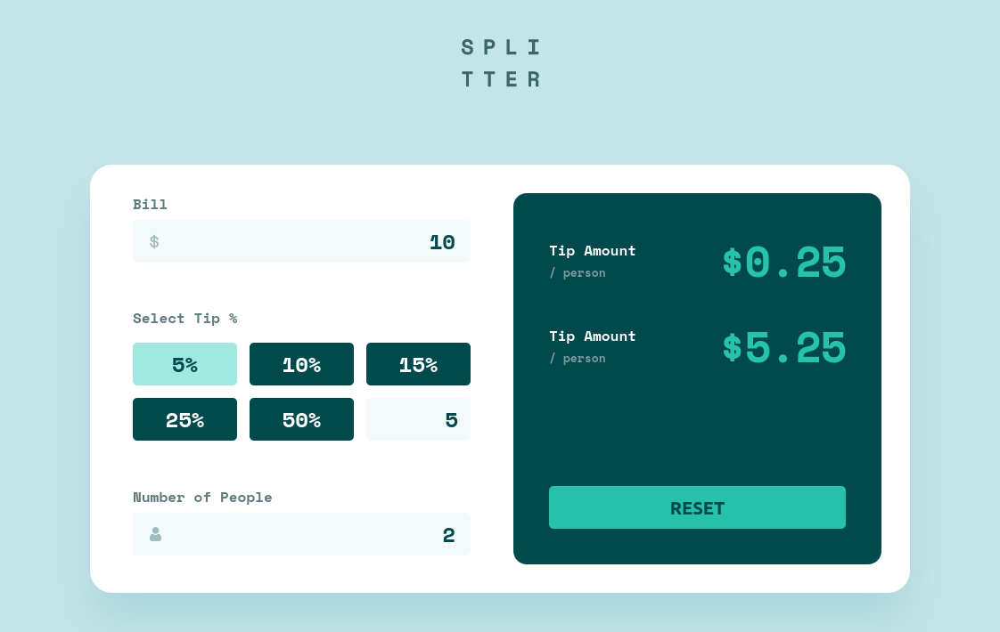
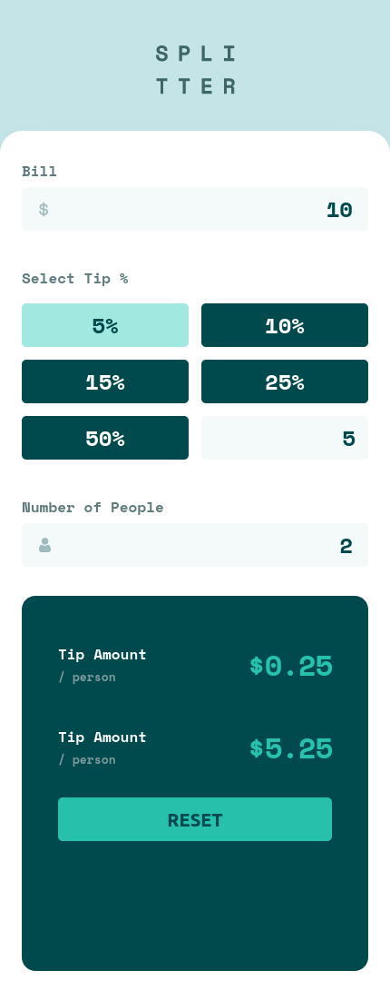

# Frontend Mentor - Tip calculator app solution

This is a solution to the [Tip calculator app challenge on Frontend Mentor](https://www.frontendmentor.io/challenges/tip-calculator-app-ugJNGbJUX).

## Table of contents

- [Overview](#overview)
  - [The challenge](#the-challenge)
  - [Screenshot](#screenshot)
  - [Links](#links)
- [My process](#my-process)
  - [Built with](#built-with)
  - [Continued development](#continued-development)
- [Author](#author)

## Overview

### The challenge

Users should be able to:

- View the optimal layout for the app depending on their device's screen size
- Calculate the correct tip and total cost of the bill per person

### Screenshot

### Links

- Solution URL: [URL](https://github.com/gio-oig/tip-calculator-app)
- Live Site URL: [URL](https://gio-oig.github.io/tip-calculator-app)

## My process

### Built with

- Semantic HTML5 markup
- CSS custom properties
- Flexbox
- Typescript
- Classnames library
- [React](https://reactjs.org/) - JS library

### Continued development

Add Tests

## Author

- LinkedIn - [Giorgi Arakhamia](https://www.linkedin.com/in/giorgi-arakhamia-007289197/)
